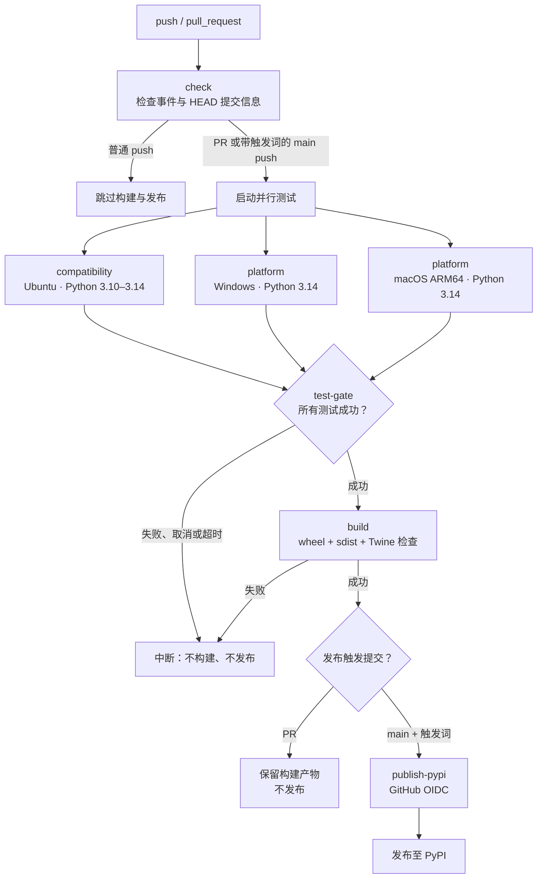
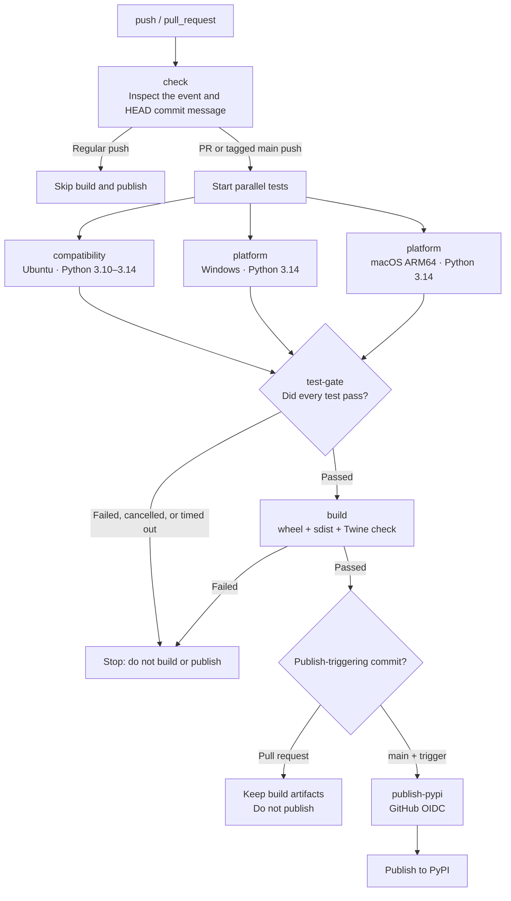

# 📦 PyPI 发布指南

## 🔑 发布触发词

工作流只会发布 `main` 分支 HEAD 提交对应的版本。提交信息必须包含以下任一完整触发词：

- `[publish-pypi]`
- `[publishpypi]`

匹配忽略大小写，但方括号不能省略，也不接受空格或其他拼写。普通 push 会运行触发检查后跳过构建和发布；pull request 会构建并验证包，但绝不会发布。

## 🔄 CI 发布流程



## 🚀 发布步骤

1. 在 `pyproject.toml` 中更新 `version`。PyPI 版本不可覆盖或重复上传。
2. 更新并提交 `uv.lock`：`uv lock`。
3. 提交时加入严格触发词，然后推送到 `main`。

```bash
git commit -m "release: 0.3.1b1 [publish-pypi]"
git push origin main
```

预发布版本使用 PEP 440 形式，例如 `0.3.1b1`。工作流会在 Ubuntu 上测试 Python 3.10 至 3.14，并在 Windows 与 macOS ARM64 上测试 Python 3.14；全部通过门禁后才会构建 wheel 和 sdist、校验元数据并发布同一份构建产物。

## 🔐 PyPI Trusted Publishing

发布使用 OIDC，不需要创建或保存 `PYPI_TOKEN`。

### 1. 在 PyPI 创建 Pending Publisher

1. 登录 [PyPI](https://pypi.org/account/login/)。
2. 打开 [PyPI Publishing](https://pypi.org/manage/account/publishing/)。
3. 下拉到 **Add a new pending publisher**。
4. 填写以下字段：

- PyPI project name: `cyber-bulb`
- GitHub owner: `VincentZyuApps`
- GitHub repository: `cyber-bulb`
- Workflow filename: `publish.yml`
- Environment name: `pypi`

5. 点击 **Add** 保存。项目不需要提前存在；首次成功发布后，Pending Publisher 会自动成为该项目的 Trusted Publisher。

### 2. 在 GitHub 创建 Environment

1. 打开仓库的 [New environment](https://github.com/VincentZyuApps/cyber-bulb/settings/environments/new) 页面。
2. 输入 `pypi`，点击 **Configure environment**。
3. 不需要添加 secret。可以直接保留默认设置，也可以按需启用 **Required reviewers**，让每次正式发布都需要人工批准。

也可以使用已登录且具有仓库 admin 权限的 GitHub CLI 创建并验证：

```bash
gh api --method PUT repos/VincentZyuApps/cyber-bulb/environments/pypi
gh api repos/VincentZyuApps/cyber-bulb/environments/pypi --jq '{name: .name, protection_rules: .protection_rules}'
```

Environment 名称必须与 PyPI 中填写的 `pypi` 完全一致，否则 OIDC 验证会失败。

### 3. 执行并检查首次发布

1. 按“发布步骤”更新版本并推送带触发词的 HEAD 提交。
2. 打开 [Publish workflow runs](https://github.com/VincentZyuApps/cyber-bulb/actions/workflows/publish.yml) 查看进度。
3. 等待 `compatibility`、`platform`、`test-gate`、`build` 和 `publish-pypi` 全部成功。
4. 打开 [cyber-bulb on PyPI](https://pypi.org/project/cyber-bulb/) 确认版本、README 和 Python 支持范围。

## 🧰 常见问题

- 没有触发发布：确认触发词位于 HEAD 提交信息中，并带有方括号。
- 测试门禁失败：检查 Ubuntu、Windows 和 macOS ARM64 job；任一失败、取消或超时都会阻止构建与发布。
- PyPI 返回版本已存在：先修改 `pyproject.toml` 版本并重新运行 `uv lock`。
- Trusted Publisher 验证失败：逐项核对 owner、repository、workflow filename 和 environment。
- 构建失败：先在本地运行 `uv sync --locked`、`uv build` 和 `uvx twine check dist/*`。

# 📦 PyPI Publishing Guide

## 🔑 Publish Trigger

The workflow publishes only the version from the HEAD commit on `main`. The commit message must contain one of these complete tokens:

- `[publish-pypi]`
- `[publishpypi]`

Matching is case-insensitive, but the square brackets are required. Spaces and other spellings are not accepted. A regular push stops after the trigger check. Pull requests build and validate the package but never publish it.

## 🔄 CI Publishing Flow



## 🚀 Release Steps

1. Update `version` in `pyproject.toml`. PyPI versions are immutable and cannot be uploaded twice.
2. Update and commit `uv.lock` with `uv lock`.
3. Include the strict trigger in the commit message and push to `main`.

```bash
git commit -m "release: 0.3.1b1 [publish-pypi]"
git push origin main
```

Use PEP 440 for pre-releases, for example `0.3.1b1`. The workflow tests Python 3.10 through 3.14 on Ubuntu and Python 3.14 on Windows and macOS ARM64. It builds the wheel and sdist, checks their metadata, and publishes those exact artifacts only after every test passes the gate.

## 🔐 PyPI Trusted Publishing

Publishing uses OIDC, so you do not need to create or store a `PYPI_TOKEN`.

### 1. Create a Pending Publisher on PyPI

1. Sign in to [PyPI](https://pypi.org/account/login/).
2. Open [PyPI Publishing](https://pypi.org/manage/account/publishing/).
3. Scroll to **Add a new pending publisher**.
4. Fill in these fields:

- PyPI project name: `cyber-bulb`
- GitHub owner: `VincentZyuApps`
- GitHub repository: `cyber-bulb`
- Workflow filename: `publish.yml`
- Environment name: `pypi`

5. Select **Add**. The project does not need to exist yet. After the first successful upload, the Pending Publisher becomes the project's Trusted Publisher automatically.

### 2. Create the GitHub Environment

1. Open the repository's [New environment](https://github.com/VincentZyuApps/cyber-bulb/settings/environments/new) page.
2. Enter `pypi`, then select **Configure environment**.
3. No secret is required. Keep the defaults, or enable **Required reviewers** if every production publish should require approval.

You can also create and verify it with an authenticated GitHub CLI session that has repository admin access:

```bash
gh api --method PUT repos/VincentZyuApps/cyber-bulb/environments/pypi
gh api repos/VincentZyuApps/cyber-bulb/environments/pypi --jq '{name: .name, protection_rules: .protection_rules}'
```

The environment name must exactly match `pypi` on PyPI, or OIDC verification will fail.

### 3. Run and Check the First Publish

1. Follow the release steps above and push a HEAD commit containing the trigger.
2. Open [Publish workflow runs](https://github.com/VincentZyuApps/cyber-bulb/actions/workflows/publish.yml) to monitor it.
3. Wait for `compatibility`, `platform`, `test-gate`, `build`, and `publish-pypi` to succeed.
4. Open [cyber-bulb on PyPI](https://pypi.org/project/cyber-bulb/) and verify the version, README, and supported Python versions.

## 🧰 Troubleshooting

- No publish job: verify that the token is bracketed and appears in the HEAD commit message.
- Test gate fails: inspect the Ubuntu, Windows, and macOS ARM64 jobs; any failure, cancellation, or timeout blocks both build and publish.
- Version already exists on PyPI: update `pyproject.toml`, then run `uv lock` again.
- Trusted Publisher verification fails: compare the owner, repository, workflow filename, and environment exactly.
- Build fails: run `uv sync --locked`, `uv build`, and `uvx twine check dist/*` locally.
