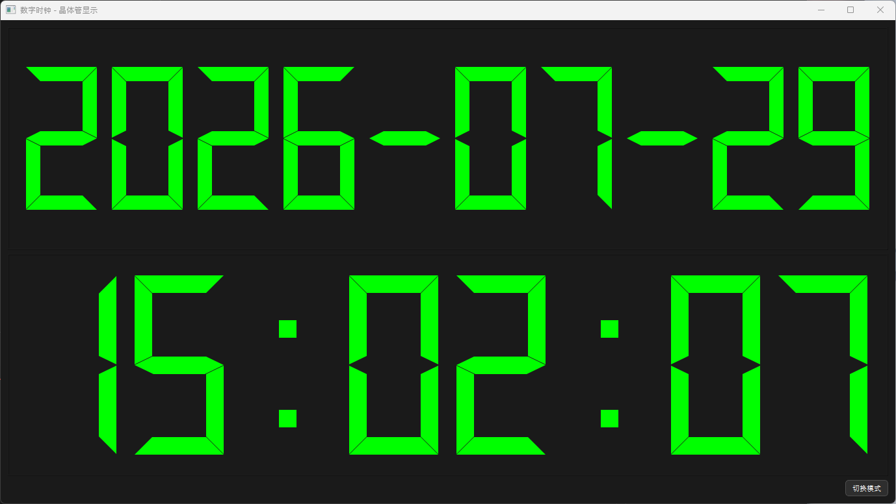

# 赛博灯泡



# Win
```powershell
python -m venv venv
.\venv\Scripts\Activate

pip install pyqt5
python bulb.py
```

# Linux
```bash
python3 -m venv venv
source venv/bin/activate

pip install pyqt5
python bulb.py
```

# Astral-UV
```bash
uv pip install pyqt5
uv run python ./bulb.py
```

# Notes

## 用Gitee+华为云镜像 安装pyenv 
> 难绷csdn文章收费
> 而且pyenv是本地编译py解释器，很慢，不推荐使用

https://blog.csdn.net/xhp312098226/article/details/137106947

## pip换源
> 注意这个换源对uv无效，uv有自己单独的配置

https://juejin.cn/post/7163949710909112356


## uv 官方安装文档
> uv还是太好用了，已经不用pyenv了，推荐使用

https://docs.astral.sh/uv/getting-started/installation/

## uv 自动安装并换源
> 一键安装uv+换源，非常推荐

https://gitee.com/wangnov/uv-custom/releases

